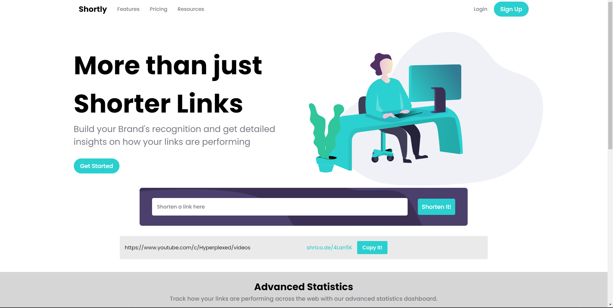

# Frontend Mentor - Shortly URL shortening API Challenge
## Welcome! 👋
This is the solution code for the problem on Frontend Mentor for creating a url shortening website.
## The challenge

Your challenge is to build out this landing page, integrate with the [shrtcode API](https://app.shrtco.de/) and get it looking as close to the design as possible.

Your users should be able to:

- View the optimal layout for the site depending on their device's screen size
- Shorten any valid URL
- See a list of their shortened links, even after refreshing the browser
- Copy the shortened link to their clipboard in a single click
- Receive an error message when the `form` is submitted if:
  - The `input` field is empty

### Screenshot
The screenshot for the solution...

### Links
Links of the hosted webpage:
https://grand-cheesecake-dc8baf.netlify.app/
GitHub Link:
https://github.com/raghav0477/url-shorten

### Built with

- Semantic HTML5 markup
- CSS custom properties
- Flexbox
## Author
Raghav Sharma

**It was fun** 🚀
